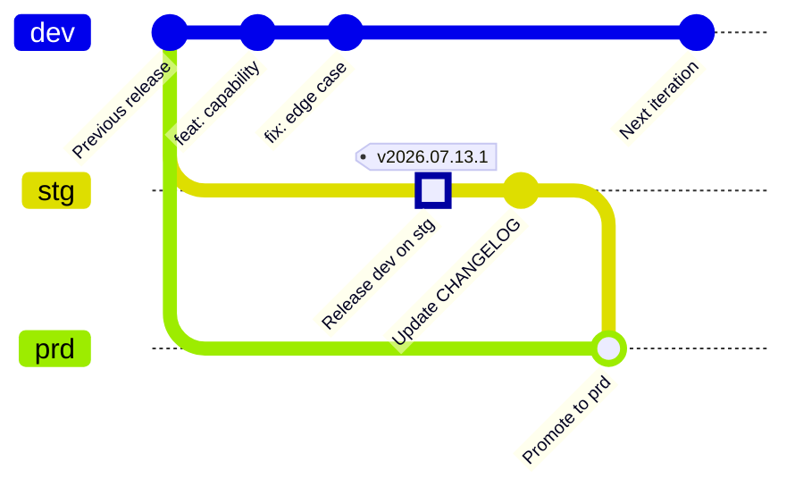

Updating a changelog by hand is easy to postpone and difficult to keep consistent. It also duplicates information that already exists in commit messages and pull requests.

The release workflow described here treats Git history as the source of truth. It combines **Conventional Commits**, **GitHub Copilot commit instructions**, **git-cliff**, the **GitHub CLI**, and **GitHub Actions** to produce:

- a CalVer GitHub release;
- release notes containing only the latest changes;
- a generated `CHANGELOG.md` committed back to the repository;
- commit and comparison links for traceability;
- a Slack release notification.

I have used this approach across many of the projects I have worked on, especially where teams release frequently. The examples below are adapted from one such project and anonymized.

## Key points

- **Commit quality determines release-note quality.** Contributors use Conventional Commit headers, while Copilot instructions help generate the expected format.
- **Releases use Calendar Versioning.** Tags follow `vYYYY.MM.DD.N`, where `N` increments when several releases occur on the same UTC date.
- **git-cliff is the formatter.** It parses, filters, groups, and renders commits according to `cliff.toml`.
- **The release notes and changelog come from the same configuration.** One git-cliff run generates the latest release body; another regenerates the repository changelog from matching commits.
- **The workflow is automated on `stg`.** A push to `stg` starts it, and maintainers can also run it manually with `workflow_dispatch`.
- **The generated changelog is part of the repository.** A GitHub App identity commits `CHANGELOG.md` back to `stg`.
- **Release communication is automatic.** The same latest-release content is published to GitHub and sent to Slack.

## How the workflow fits together

The implementation has four important files:

| File | Responsibility |
| --- | --- |
| `.github/copilot-commit-message-instructions.md` | Tells Copilot to generate Conventional Commit messages with approved types and scopes. |
| `cliff.toml` | Defines commit parsing, filtering, grouping, ordering, and Markdown rendering. |
| `.github/workflows/release.yml` | Creates the tag and GitHub release, runs git-cliff, notifies Slack, and commits the changelog. |
| `CHANGELOG.md` | Stores the generated, human-readable release history. |

### Branch and release flow

The broader delivery model uses three long-lived branches:

- `dev` — integration branch for completed development work;
- `stg` — staging branch that triggers deployment and release-note automation;
- `prd` — production branch that receives a tested release after staging validation.



The GitGraph makes the release-note boundary explicit:

1. Conventional Commits accumulate on `dev` and become the source material for the notes.
2. Merging `dev` into `stg` triggers the release workflow. The highlighted merge receives the generated CalVer tag.
3. git-cliff reads the commits since the previous release, publishes the GitHub and Slack notes, and the release bot adds the `Update CHANGELOG` commit on `stg`.
4. After validation, `stg` is merged into `prd`; meanwhile, new work can continue independently on `dev`.

The release-note workflow itself runs on `stg`. Promotion from `stg` to `prd` is a separate delivery decision and should happen only after the staging release has been validated.

The end-to-end release-note flow is:

1. Changes are merged from `dev` or pushed to `stg`.
2. GitHub Actions calculates the current UTC date and builds a prefix such as `v2026.07.13`.
3. The workflow inspects existing GitHub releases with that prefix and chooses the next suffix, producing a tag such as `v2026.07.13.2`.
4. `gh release create` creates a release targeting `stg`.
5. The repository is checked out with `fetch-depth: 0`, because git-cliff needs tags and complete history.
6. git-cliff runs with `--latest` and writes the latest notes to `CHANGES.md` inside the runner workspace.
7. Those notes replace the GitHub release body and are sent to Slack.
8. git-cliff runs again without `--latest` to regenerate `CHANGELOG.md` from the release history and matching commits.
9. A release bot commits and pushes `CHANGELOG.md` to `stg` if it changed.
10. After validation, the tested release can be promoted from `stg` to `prd` through the project’s production-delivery process.

The release workflow ignores pushes that change only `CHANGELOG.md`. This prevents the bot commit from recursively creating another release. The deployment workflow also ignores `CHANGELOG.md` and `CHANGES.md`, so documentation-only output does not redeploy the application.

## 1. Standardize commit messages

Use the Conventional Commits structure:

```text
<type>(<scope>): <subject>

<body>

<footer>
```

For example:

```text
feat(backend): add provider filtering
```

```text
fix(frontend): prevent duplicate booking submission
```

```text
docs(config): explain release automation secrets
```

The project’s Copilot instructions allow these types:

- `feat` — a new feature;
- `fix` — a bug fix;
- `docs` — documentation;
- `style` — formatting without behavioral changes;
- `refactor` — code restructuring;
- `test` — test changes;
- `chore` — build or tooling work.

They also recommend scopes such as `backend`, `frontend`, `docker`, and `config`, with a maximum line length of 72 characters.

This is not only a style preference. The git-cliff configuration filters out unconventional or unmatched commits, so an inconsistent commit can disappear from the generated notes.

## 2. Configure git-cliff

The project’s `cliff.toml` groups matching commits into readable sections:

- features;
- bug fixes;
- refactors;
- documentation;
- performance;
- styling;
- tests;
- miscellaneous tasks;
- security;
- reverts.

Selected maintenance noise—such as dependency updates, pull-request chores, specific `chore(npm)` Yarn lock-file updates, and release-preparation commits—is skipped. Commits are shown newest first. Each rendered item can contain its scope, a breaking-change marker, GitHub author, and a short linked commit SHA.

A reduced parser configuration looks like this:

```toml
[git]
conventional_commits = true
filter_unconventional = true
filter_commits = true
sort_commits = "newest"

commit_parsers = [
  { message = "^feat", group = "⛰️ Features" },
  { message = "^fix", group = "🐛 Bug Fixes" },
  { message = "^doc", group = "📚 Documentation" },
  { message = "^refactor", group = "🚜 Refactor" },
  { message = "^test", group = "🧪 Testing" },
  { message = "^chore|^ci", group = "⚙️ Miscellaneous Tasks" },
  { body = ".*security", group = "🛡️ Security" },
  { message = "^revert", group = "◀️ Revert" },
]
```

The full template also builds links between consecutive release tags and sorts scoped entries consistently.

## 3. Create the release in GitHub Actions

The CalVer step derives a release prefix from the current UTC date and increments the same-day release number:

```yaml
- name: Create CalVer release
  id: calver
  env:
    GH_TOKEN: ${{ secrets.GITHUB_TOKEN }}
    GH_REPO: ${{ github.repository }}
  run: |
    DATE=$(date -u +'%Y.%m.%d')
    PREFIX="v$DATE"
    TAGS=$(gh release list --limit 100 --json tagName -q '.[].tagName' \
      | grep "^$PREFIX\." || true)

    MAX_INDEX=0
    for TAG in $TAGS; do
      SUFFIX="${TAG##$PREFIX.}"
      if [[ "$SUFFIX" =~ ^[0-9]+$ ]] && (( SUFFIX > MAX_INDEX )); then
        MAX_INDEX=$SUFFIX
      fi
    done

    NEW_TAG="$PREFIX.$((MAX_INDEX + 1))"
    gh release create "$NEW_TAG" --target stg --generate-notes
    echo "tag=$NEW_TAG" >> "$GITHUB_OUTPUT"
```

The implementation initially asks GitHub to generate notes so the release can be created immediately. A later step replaces that body with the git-cliff output, ensuring that GitHub, Slack, and `CHANGELOG.md` share the same formatting rules.

## 4. Generate the latest notes and repository changelog

Check out all history and run git-cliff twice:

```yaml
- uses: actions/checkout@v7
  with:
    ref: stg
    fetch-depth: 0

- name: Generate release notes
  uses: orhun/git-cliff-action@v4
  id: git-cliff
  with:
    config: cliff.toml
    args: -vv --latest
  env:
    OUTPUT: CHANGES.md
    GITHUB_REPO: ${{ github.repository }}

- name: Update changelog
  uses: orhun/git-cliff-action@v4
  with:
    config: cliff.toml
    args: --verbose
  env:
    OUTPUT: CHANGELOG.md
    GITHUB_REPO: ${{ github.repository }}
```

`CHANGES.md` is temporary in this implementation: it provides the latest release content to later action steps but is not committed. `CHANGELOG.md` is the durable, repository-tracked output. Because unmatched commits are filtered, releases without included changes may not produce a changelog section.

Use `${{ steps.git-cliff.outputs.content }}` as the body for both the GitHub release update and Slack message. This avoids maintaining separate release-note templates for each destination.

## 5. Configure permissions and secrets

The `create-release` job grants `contents: write` to `GITHUB_TOKEN` so it can create the GitHub release. The changelog push uses the separate GitHub App token supplied to `actions/checkout`; that app therefore needs repository contents write access. The commit itself uses a dedicated bot name and email.

Configure Actions secrets equivalent to these anonymized placeholders:

- `RELEASE_BOT_CLIENT_ID`;
- `RELEASE_BOT_PRIVATE_KEY`;
- `RELEASE_BOT_APP_ID`, used in the bot’s no-reply email address;
- `RELEASE_NOTIFICATIONS_WEBHOOK`.

The GitHub App must be installed for the repository and allowed to write repository contents. If branch protection applies to `stg`, make sure the app is permitted to push, or change the design so the bot opens a pull request instead.

## 6. Release

In the project shown here, no local release command is required. Pushing or merging a change into `stg` triggers `.github/workflows/release.yml` automatically.

A maintainer can also start it manually:

```bash
gh workflow run release.yml --ref stg
```

Then monitor the run:

```bash
gh run watch
```

After it completes, verify:

1. a new `vYYYY.MM.DD.N` tag and GitHub release exist;
2. the release body contains the expected commit groups;
3. Slack received the same release summary;
4. `stg` contains the release bot’s `Update changelog` commit;
5. when the release contains matching commits, `CHANGELOG.md` contains the new version and compare links.

For local template development, install git-cliff and preview before changing CI:

```bash
git cliff --config cliff.toml --latest
git cliff --config cliff.toml --output CHANGELOG.md
```

Review the generated file before committing because the second command rewrites the output file.

## Practical caveats

### Documentation can become stale

An older internal runbook mentions a generic `task release` command, but the current task-runner configuration does not define it. The executable workflow is triggered directly by pushes to `stg` or by manual dispatch. Treat the workflow file—not an old runbook—as the source of truth.

### Nonconventional commits are omitted

The configuration enables both `filter_unconventional` and `filter_commits`. A commit must be Conventional Commit-compatible and match a configured parser to appear. Merge strategy therefore matters: squash-merging with a well-formed final message usually produces cleaner notes than preserving arbitrary commit messages.

### Full history is required

A shallow checkout can prevent git-cliff from finding previous tags and constructing accurate release ranges. Keep `fetch-depth: 0` in the release job.

### Concurrent releases can race

Two workflow runs starting together can inspect the same existing releases and calculate the same next suffix. Add a workflow `concurrency` group if simultaneous pushes to the release branch are possible.

```yaml
concurrency:
  group: release-stg
  cancel-in-progress: false
```

### The repository is hard-coded in `cliff.toml`

The current git-cliff remote points to a specific GitHub owner and repository. Change those values when copying the setup elsewhere, or rely on environment-driven remote context where possible.

### Only the latest 100 releases are inspected

The CalVer script uses `gh release list --limit 100`. That is normally sufficient for finding releases from the current day, but pagination or tag-based lookup would be safer for an unusually high release volume.

## Result

This workflow turns a disciplined commit history into several useful artifacts without asking a maintainer to rewrite the same information:

```text
Conventional Commits
        ↓
     git-cliff
        ↓
GitHub release + Slack notification + CHANGELOG.md
```

The main maintenance cost moves to the right place: clear commit messages and a small, version-controlled release template. Once those are reliable, release notes become a repeatable build artifact rather than a manual writing task.

## References

- [Conventional Commits](https://www.conventionalcommits.org/en/v1.0.0/)
- [git-cliff](https://git-cliff.org/)
- [git-cliff GitHub Action](https://github.com/orhun/git-cliff-action)
- [Mermaid GitGraph syntax](https://mermaid.ai/open-source/syntax/gitgraph.html)
- [GitHub CLI: `gh release create`](https://cli.github.com/manual/gh_release_create)
- [GitHub Actions: manually running a workflow](https://docs.github.com/en/actions/how-tos/manage-workflow-runs/manually-run-a-workflow)
